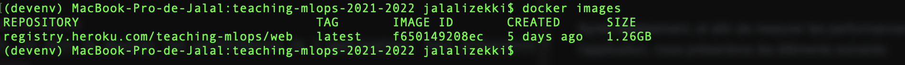
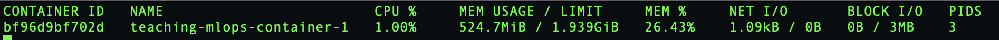
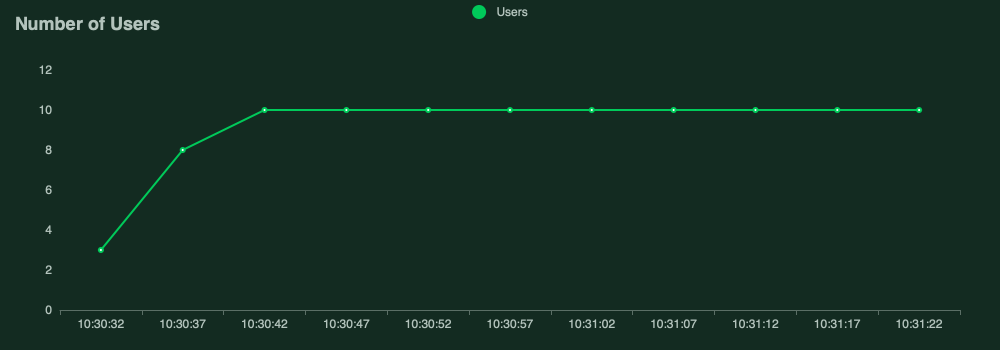
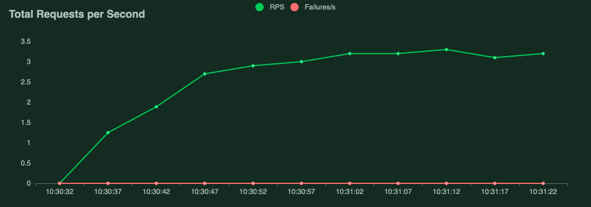

# À propos
Ce projet consiste à mettre en oeuvre les techniques de MLOps 
apprises pendant les séances de cours pour mettre en place de l'intégration continue,
une documentation de l'API, et un benchmark des performances d'un modèle de machine learning.

# Sujet
Le sujet du projet est disponible ici : https://tinyurl.com/mlops-paper

# Benchmark de performances
Après déploiement, et afin de mesurer les performances de l'application, nous présentons les éléments suivants:
## Taille de l'image
L'image docker finale fait une taille de 1.26GB. Quand un container est crée, celui-ci utilise environ 524 MiB de RAM. 
Ces ressources doivent être allouées pour le bon fonctionnement de l'application. Nous suggèrons d'avoir 1 GB de RAM à allouer.  

Nous avons utilisé l'image docker oficielle `python:3.7` comme image de base étant recommandée par le site de docker. 
Nous pourrions demander au client s'il a des contraintes de stockage, le cas échant nous pourrions utiliser une 
image de type `python:<version>-slim` (ou `<version>` est la version de `Python` à utiliser). Cette image ne contient 
que les paquêts minimaux necessaires pour lancer `Python`, ce qui devrait optimiser les ressources utilisées.
## Trafic en production
Le dossier `benchmark` contient un fichier `locustfile` que nous avons 
utilisé pour mesurer les performances de l'application déployée sur `Heroku`. Nous avons 
lancé les tests avec 10 utilisateurs. 

Les tests conduits ont permis de montrer que l'application supporte 
un trafic acceptable (`P95 = 120ms` après stabilisation pour un `3 <= RPS <= 5`).
.png)

Aucun échec de requête n'a été enregistré.

Les performances du trafic en production ci-dessus sont satisfaisantes.
Nous pensons qu'avec l'utilisation de `FastAPI` comme architecture de serveur, 
ces résulats seront améliorés, car celui-ci utilise un serveur web `ASGI` (Asynchronous Server Gateway Interface)
qui est très rapide parce qu'il est asynchrone. Cela veut dire que si on reçoit un tas de
requêtes, celles-ci n'attendront pas que les autres se terminent avant d'être traitées.

Nous sommes tout de même restés avec `bottle` étant simple et léger, et n'ayant aucunes 
autres dépendances que la bibliothèque standard de `Python`.

## Amélioration des performances
L'enrichissement des données se fait en mode hors ligne. Les données peuvent être stockées
dans une base de données accessible à d'autres machines. Nous pourrouns suggèrer les solutions suivantes : 
- Effectuer l'enrichissement de données uniquement quand les ressources (RAM, stockage, CPU / GPU) le permettent, 
c'est-à-dire quand le serveur n'est pas en train de traiter beaucoup de requêtes.
- Utiliser d'autres machines pour effectuer l'enrichissement de données au fur et à mesure, les machines 
auront accès à une base de données partagée avec le serveur.
- Utiliser des outils / APIs permettant d'effectuer l'enrichissement de donées d'une manière plus performante.

# Remarque
Afin d'éviter d'installer les dépendances deux fois (pour les tests de qualité et puis pour le build de l'image docker), nous avons décidé de copier directement l'environnement virtuel passé en tant qu'un Gitlab Artifact, cela implique que l'image de base utilisée pour créer cet environnement doit être la même que l'image utilisé dans le Dockerfile. 

# Contributeurs

- Sohaib Errabii ([serrabii@enseirb-matmeca.fr](mailto:serrabii@enseirb-matmeca.fr))
- Jalal Izekki ([jizekki@enseirb-matmeca.fr](mailto:jizekki@enseirb-matmeca.fr))